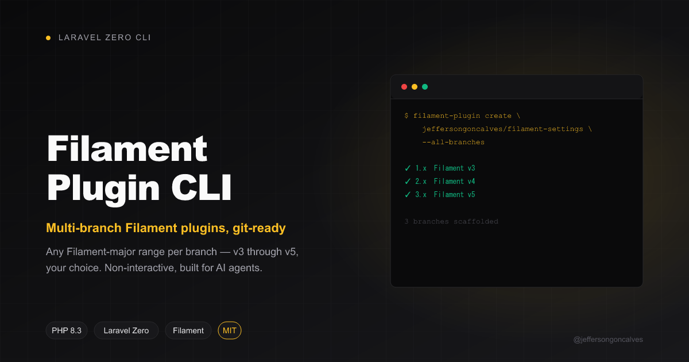

<div class="filament-hidden">



</div>

# Filament Plugin CLI

Scaffold new open-source Filament plugins with **multi-branch** git already configured, built with [Laravel Zero](https://laravel-zero.com/). Fully non-interactive — every input is an argument or a flag, so it's meant to be driven by an AI agent (e.g. Claude Code's `filament-plugin-creator` skill) as much as by a human.

<p align="center">
  <a href="https://github.com/jeffersongoncalves/filament-plugin-cli/actions"></a>
  <a href="https://packagist.org/packages/jeffersongoncalves/filament-plugin-cli"></a>
  <a href="https://github.com/jeffersongoncalves/filament-plugin-cli/blob/main/LICENSE"></a>
  
</p>

## What it does

`filament-plugin create vendor/package "Description"` generates the mechanical, repeatable part of a new Spatie-style Filament plugin, on the version branch(es) it belongs on — **never `main`**:

- Directory skeleton, boilerplate files (`.editorconfig`, `.gitattributes`, `.gitignore`, `LICENSE.md`, `CHANGELOG.md`, `README.md`, `phpstan.neon.dist`, `phpunit.xml.dist`)
- `composer.json` correct per branch (`filament/filament`, PHP floor, `orchestra/testbench` range — see the branch table below)
- Service Provider (`PackageServiceProvider`) and `Filament\Contracts\Plugin` class stubs
- `tests/TestCase.php` + `tests/Fixtures/TestPanelProvider.php` + `tests/Pest.php`
- CI workflows: branch-scoped `tests.yml`, plus `pint.yml`/`phpstan.yml`/`update-changelog.yml` covering every branch scaffolded
- `git init`, branch checkout(s), and a commit per branch

Once the plugin is written, `filament-plugin verify` runs Pint/PHPStan/Pest on every branch and `filament-plugin publish` takes it to GitHub releases and Packagist.

It deliberately does **not** write the plugin's actual logic (Plugin/Service Provider bindings, components, README body, tests, banner) — that's judgment work left to whoever (human or agent) is building the plugin on top of this scaffold.

Branch **naming** is always sequential (`1.x`, `2.x`, `3.x`, ...) — which Filament major each one targets is controlled separately via `--filament-version`/`--to-filament-version`, so a plugin doesn't have to start at Filament 3:

| Filament major | `filament/filament` | PHP | orchestra/testbench |
|-----------------|----------------------|-----|----------------------|
| 3 | `^3.0` | `^8.1` | `^8.0\|^9.0` |
| 4 | `^4.0` | `^8.2` | `^9.0\|^10.0` |
| 5 | `^5.0` | `^8.2` | `^10.0\|^11.0` |

## Requirements

- PHP 8.2+
- Git

## Installation

```bash
composer global require jeffersongoncalves/filament-plugin-cli
```

Or clone and build locally:

```bash
git clone https://github.com/jeffersongoncalves/filament-plugin-cli.git
cd filament-plugin-cli
composer install
php filament-plugin app:build filament-plugin
```

## Usage

Scaffold a single starting branch targeting Filament 3 (the defaults — branch `1.x`, `--filament-version=3`):

```bash
filament-plugin create jeffersongoncalves/filament-settings "Runtime settings panel for Filament"
```

Scaffold a single branch that starts straight at a later Filament major (e.g. the plugin never supported v3):

```bash
filament-plugin create jeffersongoncalves/filament-settings "Runtime settings panel for Filament" --filament-version=4
```

Scaffold every branch from Filament 3 through 5 in one go — `1.x`→v3, `2.x`→v4, `3.x`→v5 (`2.x` built off `1.x`, `3.x` off `2.x`):

```bash
filament-plugin create jeffersongoncalves/filament-settings "Runtime settings panel for Filament" --all-branches
```

Narrow the range — e.g. only `1.x`→v3 and `2.x`→v4 (stop before v5), or only `1.x`→v4 and `2.x`→v5 (skip v3 entirely):

```bash
filament-plugin create jeffersongoncalves/filament-settings "Runtime settings panel for Filament" --all-branches --to-filament-version=4
filament-plugin create jeffersongoncalves/filament-settings "Runtime settings panel for Filament" --all-branches --filament-version=4
```

Keywords and dependencies (the namespace already comes out right by default):

```bash
filament-plugin create jeffersongoncalves/filament-ban "Ban and unban any Eloquent model from Filament tables" \
  --keywords="laravel,filament,filament-plugin,ban,bannable" \
  --require="cybercog/laravel-ban:^4.10"
```

### Namespace

The default is the nested shape: the `filament-` prefix moves into its own segment, so the classes don't repeat it.

| Package | Namespace | Classes |
|---------|-----------|---------|
| `jeffersongoncalves/filament-ban` | `JeffersonGoncalves\Filament\Ban` | `BanServiceProvider`, `BanPlugin` |
| `jeffersongoncalves/filament-cep-field` | `JeffersonGoncalves\Filament\CepField` | `CepFieldServiceProvider`, `CepFieldPlugin` |

Both halves are studly-cased, which cannot see camel-case boundaries inside a single lowercase word (`jeffersongoncalves` → `Jeffersongoncalves`). Teach it once in `~/.package/vendornamespace.json`, shared with `laravel-package-cli`:

```json
{
    "jeffersongoncalves": "JeffersonGoncalves"
}
```

With that entry, `jeffersongoncalves/filament-ban` derives `JeffersonGoncalves\Filament\Ban` with no flags at all. Lookups are per whole slug and case-insensitive; unlisted slugs fall back to studly. See [laravel-zero-package-scaffold](https://github.com/jeffersongoncalves/laravel-zero-package-scaffold) for the file's full contract.

The config filename stays the full slug (`config/filament-ban.php`) to match `spatie/laravel-package-tools`' `shortName()`.

Pass `--namespace` only to opt out — an older plugin on the flat `JeffersonGoncalves\FilamentBan` shape, or a one-off you don't want in the shared file.

Add a version branch to a plugin repo that already exists (the existing `composer.json` is kept — only the `php`, `filament/filament` and `orchestra/testbench` constraints move):

```bash
filament-plugin branch jeffersongoncalves/filament-settings --branch=2.x --filament-version=4 --path=./filament-settings --from=1.x
```

### `create` options

| Option | Description |
|--------|-------------|
| `--branch=1.x` | Branch name for the single-branch case (default `1.x`); ignored when `--all-branches` is set |
| `--filament-version=3` | Filament major (3, 4 or 5) for the starting/single branch (default `3`) |
| `--to-filament-version=5` | Filament major to end at when `--all-branches` is set (default `5`); must be `>= --filament-version` |
| `--all-branches` | Scaffold sequential branches (`1.x`, `2.x`, ...) spanning `--filament-version..--to-filament-version` |
| `--path=DIR` | Target directory (default: `./<package>` under the current directory) |
| `--namespace=NS` | PSR-4 root namespace override, e.g. `"JeffersonGoncalves\Filament\Ban"`. Its last segment also drives the Service Provider, Plugin class and README title. Defaults to the standard nested shape (see below) — only pass it for a repo that predates the convention |
| `--keywords=LIST` | Comma-separated `composer.json` keywords (default: `laravel,filament,filament-plugin,<package>`) |
| `--require=LIST` | Extra runtime dependencies, comma-separated `name:constraint` |
| `--author="Name"` | Defaults to `git config user.name` |
| `--email=EMAIL` | Defaults to `git config user.email` |
| `--no-git` | Skip `git init`/commit |
| `--dry-run` | Print the planned file list and git commands, write nothing |

### `branch` options

| Option | Description |
|--------|-------------|
| `--branch=2.x` | Name of the branch to create (required) |
| `--filament-version=4` | Filament major (3, 4 or 5) this branch targets (required) |
| `--path=DIR` | Existing plugin repo (required) |
| `--from=1.x` | Branch to branch off (default: current `HEAD`) |
| `--dry-run` | Print the planned actions, write nothing |

Check every version branch before publishing — `composer update`, Pint, PHPStan (result cache cleared first) and Pest per branch, then a summary table. Exits non-zero if anything failed, and always returns to the branch you started on:

```bash
filament-plugin verify --path=./filament-settings
filament-plugin verify --branches=2.x,3.x
# a dependency not on Packagist yet, installed from a sibling folder (composer.json is never touched)
filament-plugin verify --local=jeffersongoncalves/laravel-settings=../laravel-settings
```

Publish a verified plugin — create the GitHub repo (wiki/projects off, topics, no homepage, release immutability on), push every `N.x` branch, make the highest one the default branch, cut `N.0.0` on each branch (only the highest one `--latest`) and submit to Packagist. Safe to re-run: anything that already exists is skipped. GitHub's API can't set the social preview image, so the command ends with a reminder to upload the banner in the repo settings.

```bash
filament-plugin publish jeffersongoncalves/filament-settings --path=./filament-settings --topics=laravel,filament,settings
# hold the releases until the package this plugin depends on is on Packagist
filament-plugin publish jeffersongoncalves/filament-settings --wait-for=jeffersongoncalves/laravel-settings:1.0.0
```

### `verify` options

| Option | Description |
|--------|-------------|
| `--path=DIR` | Plugin repo (default: current directory); the working tree must be clean |
| `--branches=LIST` | Comma-separated branches to check (default: every `N.x` branch) |
| `--local=vendor/package=PATH` | Install an unpublished dependency from a folder, through a throwaway `composer.verify.json` (repeatable) |
| `--fix` | Run Pint in fix mode instead of `--test`; its changes are committed on their own branch (`style: apply Pint`, not pushed) so they don't follow the checkout to the next branch |

### `publish` options

| Option | Description |
|--------|-------------|
| `--path=DIR` | Plugin repo (default: current directory) |
| `--description=TEXT` | GitHub description (default: `composer.json` description of the highest branch) |
| `--topics=LIST` | Comma-separated GitHub topics |
| `--wait-for=vendor/package:version` | Poll Packagist until that version exists before releasing (repeatable) |
| `--wait-timeout=900` | Seconds to wait for each `--wait-for` package |
| `--notes=TEXT` | Release notes (default: `First release for Filament N.x.`) |
| `--private` | Create a private repository |
| `--no-packagist` | Skip `packagist submit` |
| `--dry-run` | Print the commands, run nothing |

`publish` needs the `gh` CLI (authenticated) and, unless `--no-packagist`, the [`packagist` CLI](https://github.com/jeffersongoncalves/packagist-cli).

Every argument/option is designed for scripted, non-interactive invocation — no prompts are ever shown.

Update the CLI to the latest release (PHAR installs only — Git/Composer installs must update via `git pull`/`composer update`):

```bash
filament-plugin self-update
filament-plugin self-update --check
```

### `self-update` options

| Option | Description |
|--------|-------------|
| `--check` | Only check for updates without installing |

## Testing

```bash
composer test
```

## Changelog

Please see [CHANGELOG](CHANGELOG.md) for more information on what has changed recently.

## Security

If you discover any security related issues, please see [SECURITY](.github/SECURITY.md).

## Credits

- [Jefferson Goncalves](https://github.com/jeffersongoncalves)
- [All Contributors](../../contributors)

## License

The MIT License (MIT). Please see [License File](LICENSE) for more information.
